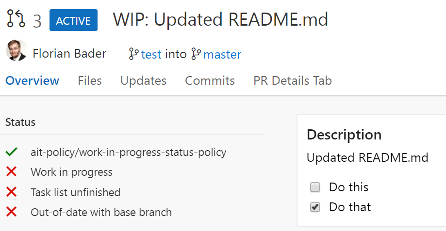
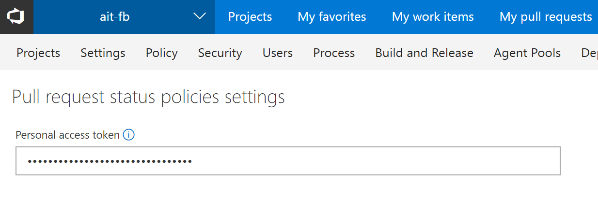
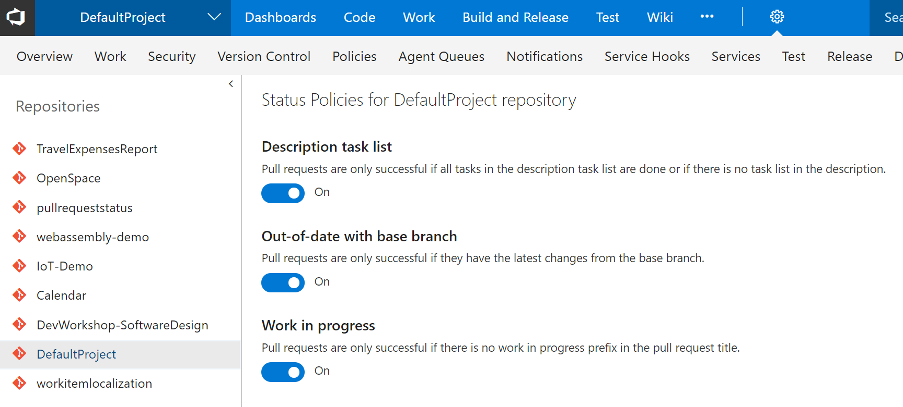
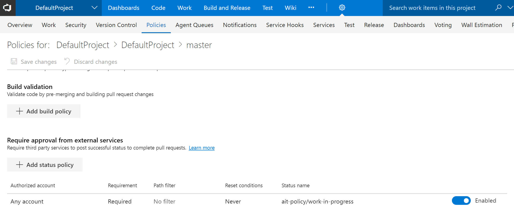

# AIT Pull Request Status Policies

Adds git pull request status policies which can be toggled for each repository. Currently the following status policies are available:

* Work in progress  
  Pull requests are only successful if there is no work in progress prefix in the pull request title.
  _Prefixes: \[WIP\], WIP:, WIP - or (WIP)_ (case insensitive)
  
* Description task list done  
  Pull requests are only successful if all tasks in the description task list are done or if there is no task list in the description.

* Out-of-date with base branch   
  Pull requests are only successful if they have the latest changes from the base branch.

# Configuration

* _Store a personal access token (Collection admin -> PR Status Policies)_  
  In order to send status updates to pull requests, create service hooks and access additional api (e.g. code) the service needs a personal access token with which all those apis are accessed. The personal access token is stored securely and encrypted and once saved it is only used in the backend service. If you want to restrict the access, the minimum scopes needed are the following:
  * Notifications (manage)
  * Code (read and write)

* _Enable status policies for your repositories (Project admin -> PR Status Policies)_  
  Not everyone wants every status policy in every repository. That's why you can toggle each status policy on and off for each repository in your team projects.

* _Set branch policy (Code -> Branches -> Branch policies)_  
  Status policies are not required to be successful to complete a pull request by default. If you want to change that, you need to add the status policies to your branch policy.

# Changelog

No changes yet

# Additional Links

* [AIT-Homepage](http://www.aitgmbh.de/)
* [AIT TFS-Tools](http://www.aitgmbh.de/downloads/team-foundation-server-tools.html)

# Privacy information

This extension operates on an external server hosted in Azure (West Europe). It stores the given personal access token in a blob storage (also hosted in Azure West Europe) which is fully encrypted at rest. The blob storage can only be accessed by the backend service and certain required service administrators and is needed to operate the extension service.

The extension and the backend service collect telemetry data using Application Insights ("AI"). As part of AI telemetry collection the standard AI telemetry data ([Microsoft Docs: Data collection, retention and storage in Application Insights](https://docs.microsoft.com/en-us/azure/application-insights/app-insights-data-retention-privacy)) as well as the VSTS account name, team project id and repository id is tracked.  
This data is used to detect errors and track feature usage.  
The telemetry is NEVER storing confidential data (e.g. the personal access token) or any other critical information (e.g. source code).

For general information on data protection, please refer to our data protection declaration.
